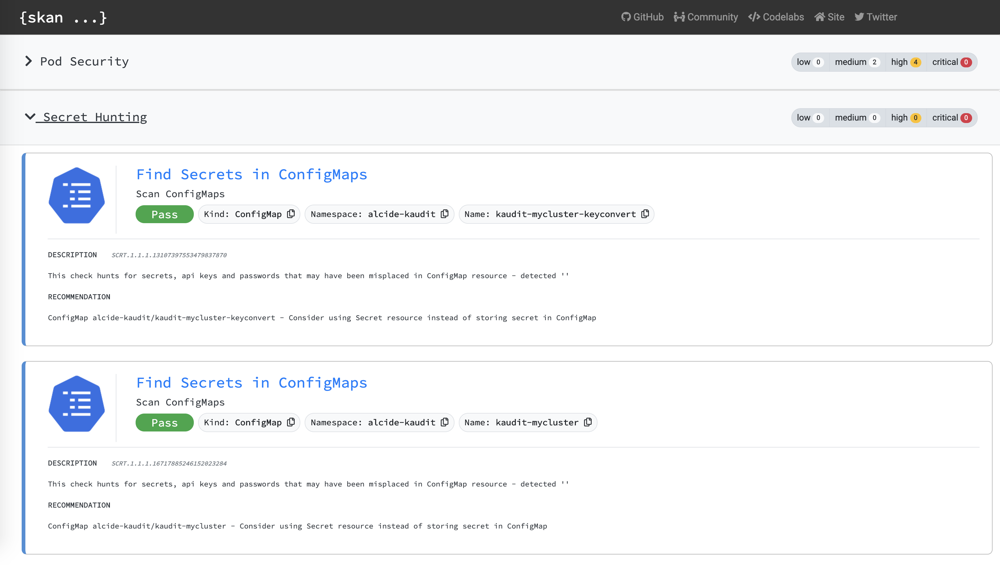

[](https://opensource.org/licenses/Apache-2.0)


###### s**K**an is powered by the [Alcide Advisor](https://www.alcide.io/kubernetes-advisor) scan engine and [Open Policy Agent (OPA)](https://www.openpolicyagent.org)

# s**K**an

s**K**an is a tailor made Kubernetes configuration files and resources scanner that enables developers and devops team members to check whether their work is compliant with security & ops best practices.

s**K**an supports Linux, Mac & Windows and the latest release is available [here](https://github.com/alcideio/skan/releases/latest).



# s**K**an Kubernetes file

```sh
$ skan manifest mydeployment.yaml
```

```sh
[skan-this] Analyzing manifest file '10' resource(s) - '9' objects
[skan-this] Ops Conformance | Workload Readiness & Liveness
[skan-this] Ops Conformance | Workload Capacity Planning
[skan-this] Workload Software Supply Chain | Image Registry Whitelist
[skan-this] Ingress Controllers & Services | Ingress Security & Hardening Configuration
[skan-this] Ingress Controllers & Services | Ingress Controller (nginx) 
[skan-this] Ingress Controllers & Services | Service Resource Checks
[skan-this] Pod Security | Workload Hardening
[skan-this] API Server Access Privileges | Privileged Kubernetes API Server Access
[skan-this] Secret Hunting | Find Secrets in ConfigMaps
[skan-this] Secret Hunting | Find Secrets in Pod Environment Variables
[skan-this] Admission Controllers | Validating Admission Controllers
[skan-this] Admission Controllers | Mutating Admission Controllers
[skan-this] Generating report (html) and saving as 'skan-result.html'
[skan-this] Summary:
[skan-this] Critical .... 0
[skan-this] High ........ 4
[skan-this] Medium ...... 2
[skan-this] Low ......... 0
[skan-this] Pass ........ 21
```

```sh
$ open skan-result.html
```

## s**K**an **Helm Chart**

```sh
$ helm template kaudit deploy/charts/kaudit --set k8sAuditEnvironment=eks | skan manifest -
```
## s**K**an **Kustomized Resources**

```sh
kubectl kustomize helloWorld | skan manifest -
```

### Command Line Example

```sh
Validate Kubernetes resource(s) handed as YAML.

YAML file with multiple resources are supported.
By default a HTML report is generated. To generate YAML based outformat use --output flag

skan manifest mydeployment.yaml

Usage:
  skan manifest [flags]

Aliases:
  manifest, file, yaml, f

Examples:

# Validate a YAML file. Multiple YAML files separated with '---' is supported
skan manifest mydeployment.yaml

# Validate the all resources found in 'myns' of a cluster using kubectl
kubectl get all -n myns -o yaml | skan manifest -

# Validate resource kustomization
kubectl kustomize helloWorld | skan manifest -

# Validate Helm Chart
helm template kaudit deploy/charts/kaudit --set k8sAuditEnvironment=eks | skan manifest -


Flags:
      --debug            debug trace level
  -h, --help             help for manifest
      --outfile string   output file (default "skan-result.html")
      --output string    output as html or yaml (default "html")
```

## Contributing

### Bugs

If you think you have found a bug please follow the instructions below.

- Please spend a small amount of time giving due diligence to the issue tracker. Your issue might be a duplicate.
- Open a [new issue](https://github.com/alcideio/rbac-tool/issues/new) if a duplicate doesn't already exist.

### Features

If you have an idea to enhance rbac-tool follow the steps below.

- Open a [new issue](https://github.com/alcideio/rbac-tool/issues/new).
- Remember users might be searching for your issue in the future, so please give it a meaningful title to helps others.
- Clearly define the use case, using concrete examples.
- Feel free to include any technical design for your feature.
